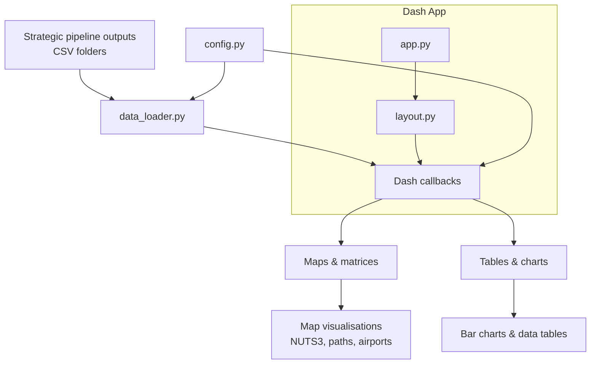

# Strategic Multimodal Dashboard

This module provides an **interactive Dash dashboard** to explore and analyse the outputs of the **Strategic Multimodal Evaluator** in MultiModX.

It is designed to support **researchers and analysts** in visually inspecting strategic scenarios, comparing policy packages, and understanding multimodal passenger flows across air ✈️, rail 🚆, and multimodal 🔁 networks.

---

## What This Dashboard Does

The dashboard allows users to:

- Select a **case study configuration** (CS, Policy Package, Network Definition, Schedule Optimiser)
- Visualise **strategic indicators** on:
  - Interactive **maps** (NUTS3 level)
  - **OD matrices**
- Inspect **passenger itineraries and paths**
- Explore **mode shares** and multimodal routing behaviour
- Drill down into **origin–destination flows** and selected paths

All visualisations are generated **from precomputed CSV outputs** of the strategic pipeline — the dashboard itself performs **no optimisation**.

---

## High-Level Architecture



---

## Core Components

### `app.py` — Application Entry Point

- Creates and configures the Dash application  
- Loads the layout  
- Registers callbacks  
- Starts the server  

Run this file to launch the dashboard.

---

### `layout.py` — User Interface Definition

Defines the **static structure** of the dashboard:

- Case study selectors (CS / PP / ND / SO)
- Visualisation mode toggle (Map / Matrix)
- Variable selector
- Graph containers
- Data tables
- Session-level stores (`dcc.Store`)

No data logic lives here — only UI structure.

---

### `callbacks.py` — Interactive Logic

Handles all **dynamic behaviour**, including:

- Case study folder resolution
- Variable loading
- Switching between map and matrix views
- Click interactions on maps
- Path selection and highlighting
- Updating tables and charts based on user actions
- Cache management (session-based)

This is where **user input becomes visual output**.

---

### `data_loader.py` — Data Access Layer

Responsible for loading and preparing input data from disk:

- Detects available **case study folders**
- Parses folder naming conventions: processed_csX.ppY.ndZ.soW, which 
  correspond to CaseStudy, PolicyPackage, NetworkDefinition and ScheduleOptimiser versions used.


Loads:
- Passenger itineraries
- Passenger paths
- NUTS3 geodata
- Rail stops
- Airport coordinates

All file access is centralised here to keep callbacks clean.

---

### `utils.py` — Visualisation & Geospatial Utilities

Contains reusable helpers for:

- Reading and reshaping CSV data
- Creating:
- Choropleth maps
- OD matrices
- Bar charts (mode shares)
- Converting GeoDataFrames to GeoJSON
- Drawing:
- Passenger paths
- Airports
- Catchment areas
- Styling and normalising visual elements (line width, colours, legends)

This file encapsulates all **plotting logic**.

---

### `config.py` — Configuration & Constants

Defines:

- Base data folders
- Map and infrastructure paths
- Available variables and labels
- File naming conventions

This allows the dashboard to be **configuration-driven**, without hardcoding paths or indicators.

---

## Inputs

The dashboard expects **precomputed strategic outputs** in the folder defined by `DATA_FOLDER` (see `config.py`).

Each case study must follow the naming pattern:

processed_cs<CS>.pp<PP>.nd<ND>.so<SO>


Typical required CSVs include:

- Passenger itineraries
- Assigned passenger paths
- Clustered itineraries
- Aggregated indicators (e.g. travel time, demand served)

⚠️ The dashboard **does not generate these files** — they must be produced by the strategic pipeline beforehand.

---

## How to Run

### 1. Install dependencies

```bash
pip install dash geopandas plotly pandas shapely matplotlib
```

(Exact environment may depend on your system setup.)

### 2. Configure paths

Edit config.py to ensure:

- DATA_FOLDER points to your strategic outputs
- MAPS_FOLDER points to NUTS shapefiles
- Infrastructure paths are valid

### 3. Run the dashboard

```
python app.py
```

Then open your browser at:
```
http://127.0.0.1:8050
```


---

## Design Characteristics

- **Read-only by design**: no optimisation or modification of data
- **Config-driven**: behaviour controlled via config.py
- **Multimodal-first**: air ✈️, rail 🚆, and multimodal 🔁 treated symmetrically
- **Traceable**: every plot maps directly to pipeline CSV outputs
- **Scalable**: supports multiple case studies and configurations

