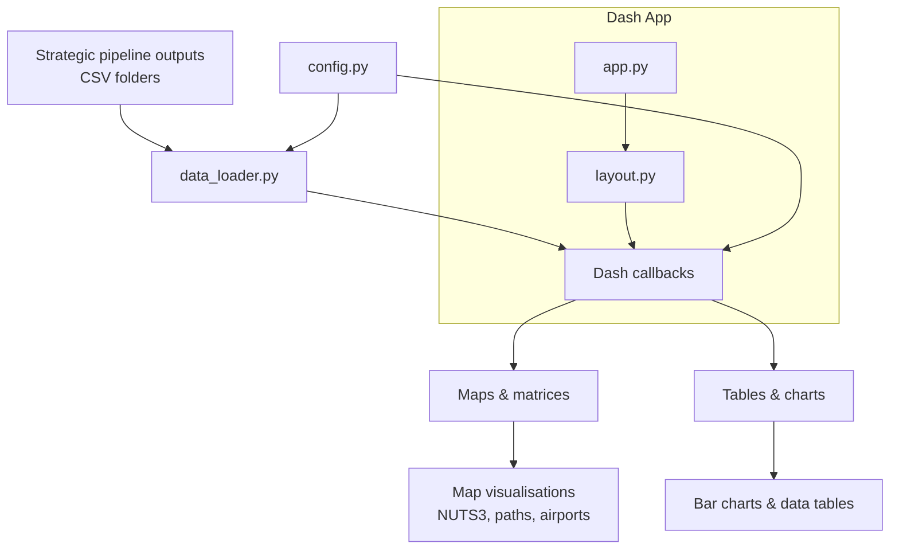

# Strategic Multimodal Dashboard

This module provides an **interactive Dash dashboard** to explore and analyse the outputs of the **Strategic Multimodal Evaluator** in MultiModX.

It is designed to support **researchers and analysts** in visually inspecting strategic scenarios, comparing policy packages, and 
understanding multimodal passenger flows across air ✈️, rail 🚆, and multimodal 🔁 networks.


## Index

1. [What this dashboard does](#1-what-this-dashboard-does)
2. [Design characteristics](#2-design-characteristics)
3. [High-level architecture](#3-high-level-architecture)
4. [Core components](#4-core-components)
5. [Inputs](#5-inputs) (including configuration (config.py) file)
6. [How to run](#6-how-to-run)

---

## 1. What This Dashboard Does

The dashboard allows users to:

- Select a **case study configuration** (CS, Policy Package, Network Definition, Schedule Optimiser)
- Visualise **strategic indicators** on:
  - Interactive **maps** (NUTS3 level)
  - **OD matrices**
- Inspect **passenger itineraries and paths**
- Explore **mode shares** and multimodal routing behaviour
- Drill down into **origin–destination flows** and selected paths

All visualisations are generated **from precomputed CSV outputs** of the strategic pipeline — the dashboard itself performs
**no optimisation** and **does not execute the models**.

The dashboard expects the results to be organised if folders with the name as follows: processed_CSxx.PPyy.NDzz.SOaa.bb,
for example `processed_CS10.pp00.nd00.so00.00`. Being:

- CS: case study
- PP: Policy package applied
- ND: Network definition (e.g. defining if alliances can be used to generate itineraries)
- SO: Schedule optimiser (i.e., if the Scheduler Optimiser has been executed)


<div style="display: grid; grid-template-columns: 1fr 1fr; gap: 1rem; align-items: start;">

<figure id="fig-strategic-dashboard" style="text-align: center;">
    
  <figcaption>
    <strong>Figure A.</strong> Strategic dashboard.
  </figcaption>
</figure>

<figure id="fig-strategic-dashboard-map" style="text-align: center;">
    
  <figcaption>
    <strong>Figure B.</strong> Example average travelling time from region.
  </figcaption>
</figure>

</div>

---

## 2. Design Characteristics

- **Read-only by design**: no optimisation or modification of data
- **Config-driven**: behaviour controlled via config.py
- **Multimodal-first**: air ✈️, rail 🚆, and multimodal 🔁 treated symmetrically
- **Traceable**: every plot maps directly to pipeline CSV outputs
- **Scalable**: supports multiple case studies and configurations


---

## 3. High-Level Architecture


```mermaid
flowchart TD
    A[Strategic pipeline outputs<br/>CSV folders] --> B[data_loader.py]

    B --> C[Dash callbacks]
    C --> D[Maps & matrices]
    C --> E[Tables & charts]

    subgraph Dash App
        F[app.py]
        G[layout.py]
        C
    end

    F --> G
    G --> C

    D --> H[Map visualisations<br/>NUTS3, paths, airports]
    E --> I[Bar charts & data tables]

    J[config.py] --> B
    J[config.py] --> C

```

---

## 4. Core Components

Main elements of the dashboard with a short description.

??? info "Dashboard components"
    
    ### `app.py` — Application Entry Point
    
    - Creates and configures the Dash application  
    - Loads the layout  
    - Registers callbacks  
    - Starts the server
    
    ---
    
    ### `layout.py` — User Interface Definition
    
    Defines the **static structure** of the dashboard:
    
    - Case study selectors (CS / PP / ND / SO)
     - Visualisation mode toggle (Map / Matrix)
     - Variable selector
     - Graph containers
     - Data tables
     - Session-level stores (`dcc.Store`)
    
    No data logic lives here — only UI structure.
    
    ---
    
    ### `callbacks.py` — Interactive Logic
    
    Handles all **dynamic behaviour**, including:
    
    - Case study folder resolution
    - Variable loading
    - Switching between map and matrix views
    - Click interactions on maps
    - Path selection and highlighting
    - Updating tables and charts based on user actions
    - Cache management (session-based)
    
    This is where **user input becomes visual output**.
    
    ---
    
    ### `data_loader.py` — Data Access Layer
    
    Responsible for loading and preparing input data from disk:
    
    - Detects available **case study folders**
    - Parses folder naming conventions: processed_csX.ppY.ndZ.soW, which 
      correspond to CaseStudy, PolicyPackage, NetworkDefinition and ScheduleOptimiser versions used.
    
    
    Loads:
    - Passenger itineraries
    - Passenger paths
    - NUTS3 geodata
    - Rail stops
    - Airport coordinates
    
    All file access is centralised here to keep callbacks clean.
    
    ---
    
    ### `utils.py` — Visualisation & Geospatial Utilities
    
    Contains reusable helpers for:
    
    - Reading and reshaping CSV data
    - Creating:
    - Choropleth maps
    - OD matrices
    - Bar charts (mode shares)
    - Converting GeoDataFrames to GeoJSON
    - Drawing:
    - Passenger paths
    - Airports
    - Catchment areas
    - Styling and normalising visual elements (line width, colours, legends)
    
    This file encapsulates all **plotting logic**.
    
    ---
    
    ### `config.py` — Configuration & Constants
    
    Defines:
    
    - Base data folders
    - Map and infrastructure paths
    - Available variables and labels
    - File naming conventions
    
    This allows the dashboard to be **configuration-driven**, without hardcoding paths or indicators.
    
    ---

## 5. Inputs

The dashboard expects **precomputed strategic outputs** in the folder defined by `DATA_FOLDER` (see `config.py`).

Each case study must follow the naming pattern:

processed_cs<CS>.pp<PP>.nd<ND>.so<SO>

Typical required CSVs include:

- Passenger itineraries
- Assigned passenger paths
- Clustered itineraries
- Aggregated indicators (e.g. travel time, demand served)

⚠️ The dashboard **does not generate these files** — they must be produced by the strategic pipeline beforehand.


### Configuration file

`dashboard/config.py` contains the configuration of the dashboard (paths to results to load and other information):

??? info "Dashboard config.py parameters"
    ```
    {{ read_file("examples/toml/dashboard_config_example.py") | indent(4) }}
    ```


---

## 6. How to Run

### 1. Install dependencies

```bash
pip install dash geopandas plotly pandas shapely matplotlib
```

(Exact environment may depend on your system setup.)

### 2. Configure paths

Edit config.py (see [Configuration file section](#configuration-file)) to ensure:

- DATA_FOLDER points to your strategic outputs
- MAPS_FOLDER points to NUTS shapefiles
- Infrastructure paths are valid

### 3. Run the dashboard

Scrip inside [dashboard](https://github.com/UoW-ATM/MultiModX/tree/main/dashboard) folder:

```
python strategic_dashboard.py
```

Then open your browser at:
```
http://127.0.0.1:8050
```
