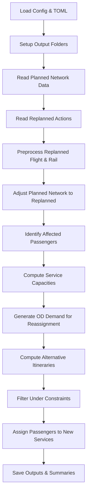

# Pre-Tactical Passenger Replanning Pipeline

This document describes the **pre-tactical passenger replanning pipeline** used to handle service disruptions in air/rail multimodal networks and to **reassign passengers** affected by such disruptions.  
The pipeline reads planned network outputs, applies replanning actions (cancellations, additions, modified schedules), identifies impacted passengers and generates **reassigned itineraries** and related performance indicators.

This flow is implemented in:  
`script/pre-tactical/replanning_passengers_script.py` in this repository.

---

## Conceptual Overview

Under disruption scenarios (e.g., cancelled flights or trains, significant delays), the **planned multimodal transport network** may no longer deliver feasible itineraries for all passengers.

The pre-tactical replanning pipeline:

1. **Modifies the planned network supply** to reflect replanning actions.
2. **Identifies which passengers are still feasible** (kept or delayed but connected) and which require reassignment.
3. **Computes capacity availability** and **alternative itineraries** for impacted passengers.
4. **Assigns passengers to new itineraries** under capacity and constraints.
5. **Outputs stranded and reassigned passenger records** along with performance summaries.

---

## Inputs

### **Configuration**

- `toml_config` — Replanning and network paths defined in a TOML file (experiment paths, replanned actions folder, planned network info).

### **Planned Network Inputs**
These are taken from outputs of the strategic pipeline for the baseline scenario:

- Passenger assignments to itineraries prior to disruption  
- Flight schedules (processed)  
- Rail timetables (processed GTFS)  
- Rail GTFS stops and stops considered  
- Capacity per service (pre-computed)

### **Replanned Network Inputs**
These reflect modifications applied due to disruption:

- Cancelled flights/trains  
- Modified (replanned) flight schedules  
- Modified (replanned) rail timetables  
- Additional flights/trains added post-disruption

### **Infrastructure Parameters**
Min. Connecting Times (MCTs) and transition layers between modes.

---

## Pipeline Outputs

| Output file | Description |
|-------------|-------------|
| `0.pax_assigned_to_itineraries_options_status_replanned_#.csv` | Passenger itinerary status after replanning |
| `1.pax_assigned_to_itineraries_options_kept_#.csv` | Passengers whose itineraries remain valid |
| `1.1.pax_assigned_kept_unnafected_#.csv` | Unaffected passengers |
| `1.2.pax_assigned_kept_affected_delayed_or_connections_kept_#.csv` | Kept but impacted passengers |
| `2.pax_assigned_need_replanning_#.csv` | Passengers needing reassignment |
| `services_w_capacity_#.csv` / `services_wo_capacity_#.csv` | Services with/without available capacity |
| `services_capacities_#.csv` | Available seats per service |
| `demand_missing_reaccomodate_#.csv` | OD demand needing reassignment |
| `pax_need_replanning_w_it_options_#.csv` | Alternative itineraries per pax |
| `pax_need_replanning_w_it_options_filtered_w_constraints_#.csv` | Filtered (constraint-respecting) itinerary alternatives |
| `pax_stranded_#.csv` | Passengers without feasible options |
| `pax_reassigned_results_solver_#.csv` | Final assignments for reassigned passengers |
| `pax_demand_assigned_#.csv` | Demand volumes assigned per new itinerary |
| `5.pax_demand_assigned_summary_#.csv` | Summary of assigned/unfulfilled demand |

---

## High-Level Pipeline Steps

1. **Load TOML configuration and setup output folders**  
2. **Read planned network outputs**  
3. **Read replanned actions** (cancelled, replanned, added services)  
4. **Preprocess replanned flight and rail schedules**  
5. **Adjust network with replanning actions**  
6. **Identify passenger status after replanning** (kept vs need replanning)  
7. **Compute capacity available per service**  
8. **Construct OD demand requiring reassignment**  
9. **Compute alternative itineraries in replanned network**  
10. **Filter alternatives under constraints (alliances, connections)**  
11. **Assign passengers to services via optimization**  
12. **Output reassigned passengers, stranded cases, and summary CSVs**

---

## Mermaid Operational Flow Diagram



## KPI Computation After Replanning

The file  
`performance_indicators/kpi_lib_replanned.py`  
provides routines to compute **Key Performance Indicators (KPIs)** from the outcome of the **passenger reassignment process** after disruption.

These KPIs are derived from the **replanned passenger itineraries**, **service schedules**, and **assignment results**, and are intended to quantify the impacts of disruption and replanning strategies.

Typical indicators include:

- **Total travel time changes**
- **Missed connections and denied boarding**
- **Load factor variations**
- **Mode share impacts** (air / rail / multimodal)

KPI computation is typically performed **after** the replanning assignment has completed and relies on the final reassigned schedules and passenger data.

---

## Intended Audience

This documentation targets:

### Researchers
- Study disruption management strategies
- Analyse passenger reallocation mechanisms
- Compare policy or operational scenarios

### Scenario Analysts
- Run replanning experiments under different disruption assumptions
- Inspect stranded demand and reassignment performance
- Feed results into downstream evaluation tools

### Developers
- Maintain or extend the pre-tactical passenger management code
- Modify constraints, objectives, or solver configurations

---

## Design Characteristics

- **Modular**  
  Each processing stage produces explicit outputs for traceability.

- **Configuration-driven**  
  Behaviour is controlled via TOML configuration files, not code changes.

- **Clear data lineage**  
  Every major pipeline milestone corresponds to one or more output CSV files.

- **Constraint-aware**  
  Alternative itineraries respect operational constraints such as:
  - Alliances
  - Maximum connections
  - Capacity limits

- **Optimisation-based**  
  Passenger reassignment leverages configurable optimisation solvers.

---

## How to Use

### 1. Define a TOML configuration

Specify:
- Planned network paths
- Replanned scenario folder
- Output folder structure
- Replanning constraints and optimisation objectives

### 2. Run the replanning script

```bash
python replanning_passengers_script.py -tf your_config.toml
```


---

# 2️⃣ `inputs.md` — *Pre-Tactical Replanning Input Data Formats*

# Pre-Tactical Replanning Input Data Formats

This document describes the **input data formats** required by the **pre-tactical passenger replanning pipeline**.

Inputs consist of:
- Planned network outputs
- Replanned operational modifications
- Infrastructure and transfer constraints

All paths are provided via the TOML configuration file.

---

## 1. Planned Passenger Assignments

**Description:**  
Passenger itineraries from the strategic or planned scenario.

**Typical content:**
- Passenger or demand identifier
- Assigned itinerary
- Service sequence
- Travel times and costs

**Source:**  
Output of the strategic pipeline.

---

## 2. Planned Flight Schedules

**Description:**  
Baseline flight schedules prior to disruption.

**Format:** CSV

Key fields include:
- `service_id`
- `origin`, `destination`
- `sobt`, `sibt`
- `provider`
- `seats`

---

## 3. Planned Rail Schedules (GTFS)

**Description:**  
Rail services in GTFS format.

**Required files:**
- `stops.txt`
- `trips.txt`
- `stop_times.txt`
- `calendar.txt`

Used to construct the planned rail network.

---

## 4. Rail Stations Considered

**File:** `rail_stations_considered.csv`

| Column | Description |
|------|-------------|
| stop_id | GTFS stop identifier |

Only the listed stations are retained in the replanning network.

---

## 5. Replanned Actions – Flights

**Description:**  
Operational changes applied after disruption.

Possible inputs:
- Cancelled flights
- Modified flight schedules
- Additional flights

These override or extend the planned flight network.

---

## 6. Replanned Actions – Rail

**Description:**  
Rail timetable changes due to disruption.

Possible inputs:
- Cancelled rail services
- Modified rail trips
- Additional rail trips

Applied on top of the planned GTFS network.

---

## 7. Minimum Connecting Times (MCT)

**Description:**  
Minimum transfer times between services.

**Includes:**
- Air-to-air
- Rail-to-rail
- Air-to-rail transitions

Used to validate itinerary feasibility during reassignment.

---

## 8. Capacity Information

**Description:**  
Available capacity per service after replanning.

Computed internally from:
- Planned seat counts
- Already assigned passengers
- Cancelled services

---

## Notes

- All inputs must be temporally consistent (time zones, date formats).
- Identifiers (service IDs, stop IDs) must match across datasets.
- Inputs are assumed to be **pre-validated** for structural correctness.


# KPI Computation for Replanned Scenarios

This document describes the **Key Performance Indicator (KPI)** computation applied to the outputs of the pre-tactical passenger replanning pipeline.

KPI routines are implemented in:

`performance_indicators/kpi_lib_replanned.py`

---

## Purpose

The KPI module evaluates the **system-level and passenger-level impacts** of disruptions and replanning decisions.

It enables:
- Comparison of alternative replanning strategies
- Quantification of passenger inconvenience
- Assessment of operational robustness

---

## Inputs

KPIs are computed using outputs from the replanning pipeline, including:

- Reassigned passenger itineraries
- Final replanned schedules (air and rail)
- Passenger delays and missed connections
- Service capacity utilisation

---

## Key Indicators

Typical KPIs include:

### Passenger-Centric

- Total travel time increase
- Delay distributions
- Missed connections
- Denied boarding events
- Number of stranded passengers

### Service-Centric

- Load factor variation
- Capacity utilisation
- Service saturation levels

### System-Level

- Mode share changes (air / rail / multimodal)
- Reaccommodated vs unmet demand
- Network resilience metrics

---

## Execution Timing

KPI computation is performed **after**:

1. Passenger reassignment is completed
2. Final itineraries and service loads are available

KPIs depend on the **final state** of the replanned network and passenger assignments.

---

## Usage

Typical workflow:

1. Run the pre-tactical replanning pipeline
2. Collect final passenger and service CSV outputs
3. Invoke KPI routines from `kpi_lib_replanned.py`
4. Analyse KPIs for scenario comparison and reporting

---

## Intended Use

The KPI module supports:
- Research analysis
- Scenario benchmarking
- Policy and operational evaluation
- Input generation for higher-level decision support tools
