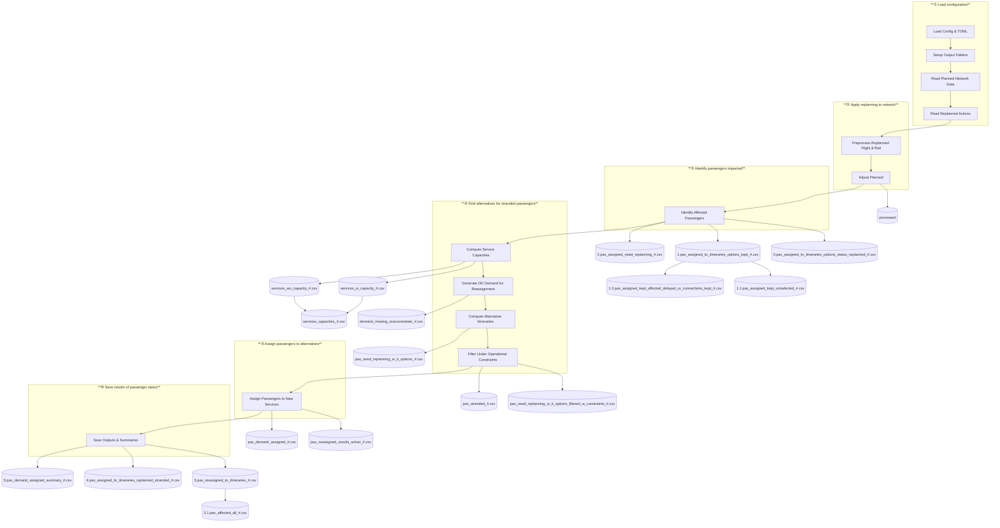

# Pre-Tactical Passenger Replanning Pipeline

The **pre-tactical passenger replanning** builds on the capabilities of the [Strategic Pipeline](../strategic/index.md) 
to evaluate the impact of replanning services (retiming (e.g. delaying), cancelling and adding flight and/or rail services)
on passenger itineraries. These replanned operations are as reaction to disruptions in the system ⚡.

See additional documentation for information on:

- [Input Files](../examples/input_format.md#4-pretactical-replanning-pipeline-inputs)
- [TOML examples](../examples/toml_examples.md#4-pretactical-pipeline)
- [Performance indicators computation](../performance_indicators/index.md#pre-tactical-replanned-operations-indicators)


## 1. How to Use

### 1. Define a TOML configuration

Specify:

- Planned network paths
- Replanned scenario folder with the replanning actions (cancellation, addition, temporal modification of air ️✈️ and rail 🚆 services)
- Output folder structure
- Replanning constraints, to control which itineraries are valid as alternatives, and optimisation objectives, to select how to assign passengers to alternatives.

See [TOML](../examples/toml_examples.md#4-pretactical-pipeline) for examples and description.

### 2. Run the replanning script

```bash
python replanning_passengers_script.py -tf your_config.toml -np 100 -ni 50 -mc 1 -hpc -ppv 0
```

---

## 2. Intended Audience

This documentation targets:

### Researchers
- Study disruption management strategies
- Analyse passenger reallocation mechanisms
- Compare policy or operational scenarios

### Scenario Analysts
- Run replanning experiments under different disruption assumptions
- Inspect stranded demand and reassignment performance
- Feed results into downstream evaluation tools

### Developers
- Maintain or extend the pre-tactical passenger management code
- Modify constraints, objectives, or solver configurations

---


## 3. Key Design Characteristics

- **Modular**  
  Each processing stage produces explicit outputs for traceability.

- **Configuration-driven**  
  Behaviour is controlled via TOML configuration files, not code changes.

- **Clear data lineage**  
  Every major pipeline milestone corresponds to one or more output CSV files.

- **Constraint-aware**  
  Alternative itineraries respect operational constraints such as:
  - Alliances
  - Maximum connections
  - Capacity limits

- **Optimisation-based**  
  Passenger reassignment leverages configurable optimisation solvers.

---


## 4. High-level pipeline flow


The pipeline identifies passengers affected by the replanning and **reassign** otherwise stranded passengers in the
replanned network. This reassigment considers services capacities and reassigment policies (e.g. maintain operators,
enable mutimodality).

The pipeline reads planned network outputs from the Strategic Pipeline and applies replanning actions (cancellations ❌, 
additions ️✈️, modified schedules 🚆). It then identifies the impacted passengers and generates **reassigned itineraries** and
related performance indicators 📈).

This flow is implemented in:  
[`script/pre-tactical/replanning_passengers_script.py`](https://github.com/UoW-ATM/MultiModX/blob/main/script/pre-tactical/replanning_passengers_script.py) in the repository.


Under disruption scenarios (e.g., cancelled flights or trains, significant delays), the **planned multimodal transport network** may no longer deliver feasible itineraries for all passengers.
The pipeline identifies the status of passengers and, for those stranded, finds possible alternative itineraries and reallocate them.


### Inputs

#### **Configuration**

- `toml_config` — Replanning and network paths defined in a TOML file (experiment paths, replanned actions folder, 
planned network info) (see [TOML](../examples/toml_examples.md#4-pretactical-pipeline) section). The configuration file 
includes, crucially, the flexibility to be used to find suitable alternatives for stranded passengers.

#### **Planned Network Inputs**
These are taken from outputs of the strategic pipeline (considering the **originally planned** network):

- Passenger assignments to itineraries prior to disruption  
- Flight schedules (processed)  
- Rail timetables (processed GTFS)  
- Rail GTFS stops and stops considered  
- Other network parameters, such as:
  - Processing time of passengers at infrastructure nodes
  - Minimum connecting times intra-mode
  - Regions access/egress
  - Multimodal connectivity between layers with minimum connecting times (MCTs)

#### **Replanned Network Inputs**
These reflect modifications applied due to disruption:

- Cancelled flights/trains  
- Modified (replanned) flight schedules  
- Modified (replanned) rail timetables  
- Additional flights/trains added post-disruption

See [Input Files](../examples/input_format.md#4-pretactical-replanning-pipeline-inputs) section for examples.


### High-Level Pipeline Steps


The pre-tactical replanning pipeline:

1. **Load configuration**: Reads the [TOML](../examples/toml_examples.md#4-pretactical-pipeline) configuration file and the replanning operations from the `replanned_actions` folder.
2. **Applies the replanning to the network**: Read the _planned network_ and modifies its supply to reflect replanning actions (cancellations, replanned, added services) .
3. **Identifies how passengers are impacted**: Classify passengers between not affected, affected but that can keep their itinerary (e.g., delayed, connections can be kept), and passengers who would be stranded (i.e., cancelled services and missed connections) (kept or delayed but connected).
4. **Find alternatives for stranded passengers**: Recompute capacities available in services (removing stranded passengers), and using the capabilities of the [Strategic Evaluator](../strategic/index.md) compute possible itineraries for the stranded passengers. Finally, filtering alternatives to keep the ones that respect the defined operational constraints (e.g. keep (or not) operator, keep (or not) origin and/or destination infrastructure nodes (airports, rail stations)) 
5. **Assigns passengers to new itineraries**: Assign stranded passengers into alternatives under capacity and constraints, based on lexicographic optimisation defined in TOML configuration file (e.g. minimise stranded passengers, arrive as close as originally planned).
6. **Save results with passenger status**: Save passenger status along with performance summaries.


### Mermaid Operational Flow Diagram



### Pipeline Outputs
Not exhaustive list of outputs

| Folder                                                                        | Output file                                                        | Description                                                                                                                               |
|-------------------------------------------------------------------------------|--------------------------------------------------------------------|-------------------------------------------------------------------------------------------------------------------------------------------|
| pax_replanned                                                                 | `0.pax_assigned_to_itineraries_options_status_replanned_#.csv`     | Passenger itinerary status after replanning                                                                                               |
| pax_replanned                                                                 | `1.pax_assigned_to_itineraries_options_kept_#.csv`                 | Passengers whose itineraries remain valid (could be delayed)                                                                              |
| pax_replanned                                                                 | `1.1.pax_assigned_kept_unnafected_#.csv`                           | Unaffected passengers (subset from 1, i.e., not delayed)                                                                                  |
| pax_replanned                                                                 | `1.2.pax_assigned_kept_affected_delayed_or_connections_kept_#.csv` | Kept but impacted passengers (subset from 1)                                                                                              |
| pax_replanned                                                                 | `2.pax_assigned_need_replanning_#.csv`                             | Passengers needing reassignment (otherwise stranded)                                                                                      |
| pax_replanned                                                                 | `3.pax_reassigned_to_itineraries_#.csv`                            | Reassigned passengers to new itineraries                                                                                                  |
| pax_replanned                                                                 | `3.1.pax_affected_all_#.csv`                                       | All affected passengers (reassigned and delayed)                                                                                          |
| pax_replanned                                                                 | `4.pax_assigned_to_itineraries_replanned_stranded_#.csv`           | All passengers needed to be replanned but ended up stranded                                                                               |
| pax_replanned                                                                 | `5.pax_demand_assigned_summary_#.csv`                              | Summary of assigned/unfulfilled demand                                                                                                    |
| paths_itineraries | `demand_missing_reaccomodate_#.csv`                                | OD demand needing reassignment (comptued from 2)                                                                                          |
| paths_itineraries | `services_capacities_#.csv`                                        | Services seats capacities                                                                                                                 |
| paths_itineraries | `services_capacities_available.csv`                                | Available seats per service                                                                                                               |
| paths_itineraries | `services_w_capacity_#.csv` / `services_wo_capacity_#.csv`         | Services with/without available capacity                                                                                                  |
| paths_itineraries | `potential_paths_#.csv`                                            | Potential paths for stranded passengers itineraries                                                                                       |
| paths_itineraries | `possible_itineraries_#.csv`                                       | Possible itineratires for stranded passengers                                                                                             |
| paths_itineraries | `pax_need_replanning_w_it_options_#.csv`                           | Passengers stranded that have options (itineraries)                                                                                       |
| paths_itineraries | `pax_need_replanning_w_it_options_filtered_w_constraints_#.csv`    | Passengers stranded that have options (itineraries) once operational constraints are considered (e.g. keep operator, allow multimodality) |
| paths_itineraries | `pax_stranded_#.csv`                                               | Passengers stranded                                                                                                                       |
| paths_itineraries | `pax_demand_assigned_#.csv`                                        | Demand volumes assigned per new itinerary                                                                                                 |
| paths_itineraries | `pax_reassigned_results_solver_#.csv`                              | Outcome of assigment solver (which considers lexicographic optimisation to select itinerary from options available)                       |
| processed | `flight_schedules_proc_#.csv`, `rail_timetable_proc_#.csv`, etc. | Replanned network (schedules, timetables once the replannign has been performed)                                                          |


### KPI Computation After Replanning

The file  
[`performance_indicators/kpi_lib_replanned.py`](https://github.com/UoW-ATM/MultiModX/blob/main/performance_indicators/kpi_lib_replanned.py) in the repository  
provides routines to compute **Key Performance Indicators (KPIs)** from the outcome of the **passenger reassignment process** after disruption. See the [Performance Indicators](../performance_indicators/index.md#replanned) documentation for more detail.

These KPIs are derived from the **replanned passenger itineraries**, **service schedules**, and **assignment results**, and are intended to quantify the impacts of disruption and replanning strategies.

Typical indicators include:

- **Total travel time changes**
- **Missed connections and stranded passengers**
- **Load factor variations**
- **Mode share impacts** (air / rail / multimodal)

KPI computation is typically performed **after** the replanning assignment has completed and relies on the final reassigned schedules and passenger data.

