# Strategic Evaluator

**Strategic Pipeline** used to evaluate air, rail and multimodal networks: paths and itineraries computation,
demand assigment and passenger itineraries generation.

This includes:

- [Strategic Pipeline Flow](#strategic-pipeline-flow)
- [Input file formats](../examples/input_format.md)
- [TOML examples](../examples/toml_examples.md)


# Strategic Pipeline Flow

See al technical documents and articles from remaining documentation. For detailed Functional Description on the Strategic Multimodal Evaluator see [D4.3_Solution_399_FRD.pdf](/documentation/documents/D4.3_Solution_399_FRD.pdf).

This section describes the high-level architecture and data flow of the
**Strategic Evaluator pipeline**, implemented in: run_full_strategic_pipeline function in 
[strategic_pipeline.py](/script/strategic/strategic_pipeline.py)


It is intended to:
- give **researchers** a clear conceptual overview of the modelling flow, and
- help **users** understand configuration, execution stages, and generated outputs.

The pipeline is intentionally **mostly linear**: configuration modifies behaviour
within stages rather than introducing complex branching.

The [strategic_aw_pipeline.py](/script/strategic/strategic_aw_pipeline.py) instead of computing the possible paths from
the flights schedules uses the paths from Aviation Week flows and joins the international demand with the intra-Spain
mobility precomputed. Used for 
[SESAR Innovation Days 2025 - Air-rail Multimodal Disruption Management](/documentation/articles/SIDs_2025_paper_108-final.pdf)
article. Kept in repository as an example on how to use precomputed paths to find possible itineraries instead of
running the 'Computation of potential paths'.

--

## Example of execution
```
python strategic_pipeline.py -tf ../../data/CS_example/v=0.1/CS_example.PP00.toml -ni 50 -np 100 -mc 2 -hpc -pc 10  -v -ppv 0 -lf ./log_file.txt
```

---

## 1. High-level pipeline flow

### Legend
- **Rectangles**: processing steps
- **Hexagons**: CSV outputs written to disk
- ✈️ air-specific
- 🚆 rail-specific
- 🔀 multimodal

```mermaid
flowchart TD

%% ================= LOAD CONFIGURATION =================
subgraph STAGE1["① Load configuration"]
    CFG["Load configuration<br/>(TOML files)"]
    GEN["General parameters"]
    POL["Policy package"]
    AIR_CFG["Air config ✈️"]
    RAIL_CFG["Rail config 🚆"]
    MM_CFG["Multimodal config 🔁"]

    CFG --> GEN
    CFG --> POL
    CFG --> AIR_CFG
    CFG --> RAIL_CFG
    CFG --> MM_CFG
end

%% ================= PREPROCESS INPUT =================
subgraph STAGE2["② Preprocess input"]
    PRE["Preprocess inputs"]
    AIR_NET["Prepare air network ✈️"]
    RAIL_NET["Prepare rail network 🚆"]
    POL_APP["Apply policy package"]

    GEN --> PRE
    POL --> PRE
    AIR_CFG --> PRE
    RAIL_CFG --> PRE
    MM_CFG --> PRE

    PRE --> AIR_NET
    PRE --> RAIL_NET
    PRE --> POL_APP
end

AIR_NET --> CSV_AIR[(air_network_preprocessed.csv)]
RAIL_NET --> CSV_RAIL[(rail_network_preprocessed.csv)]
POL_APP --> CSV_POL[(policy_applied_inputs.csv)]

%% ================= COMPUTE POTENTIAL PATHS =================
subgraph STAGE3["③ Compute potential paths"]
    SIMP_NET["Build simplified multimodal network 🔁"]
    POT_PATHS["Compute potential paths"]

    AIR_NET --> SIMP_NET
    RAIL_NET --> SIMP_NET
    POL_APP --> SIMP_NET

    SIMP_NET --> POT_PATHS
end

POT_PATHS --> CSV_POT[(potential_paths.csv)]
SIMP_NET --> CSV_SNET[(simplified_multimodal_network.csv)]

%% ================= COMPUTE POSSIBLE ITINERARIES =================
subgraph STAGE4["④ Compute possible itineraries"]
    FULL_NET["Build full multimodal network 🔁"]
    ITIN["Compute possible itineraries"]
    AVG["Average paths"]
    CLUST["Cluster itineraries"]
    PARETO["Pareto filtering"]
    FILTER["Filter usable itineraries"]

    POT_PATHS --> FULL_NET
    FULL_NET --> ITIN
    ITIN --> AVG
    AVG --> CLUST
    CLUST --> PARETO
    PARETO --> FILTER
end

FULL_NET --> CSV_FNET[(full_multimodal_network.csv)]
FILTER --> CSV_ITIN[(possible_itineraries.csv)]
CLUST --> CSV_CLUST[(itinerary_clusters.csv)]

%% ================= ASSIGN DEMAND =================
subgraph STAGE5["⑤ Assign demand"]
    ASSIGN["Assign demand to paths"]
    AGG["Aggregate demand per cluster"]
    PAX["Assign passengers to services"]

    FILTER --> ASSIGN
    ASSIGN --> AGG
    AGG --> PAX
end

ASSIGN --> CSV_PATH_DEM[(path_demand.csv)]
AGG --> CSV_AGG[(cluster_demand.csv)]
PAX --> CSV_ASSIGN[(assigned_passengers.csv)]

%% ================= GENERATE TACTICAL INPUTS =================
subgraph STAGE6["⑥ Generate tactical inputs"]
    TACT["Generate tactical inputs"]
end

PAX --> TACT
TACT --> CSV_TAC[(tactical_inputs.csv)]


```




## 2. Preprocessing Stage (Conceptual View)

The **preprocessing stage** is where raw inputs and configuration files are converted into
**modelling-ready objects** used by the downstream strategic pipeline.

This stage includes:

- Harmonisation of **air ✈️ and rail 🚆 networks**
- Application of **policy package** modifications (e.g. bans, penalties, constraints)
- Standardisation of parameters used downstream:
  - travel times
  - costs
  - penalties and generalised costs

Conceptually:

- ❌ No demand assignment happens at this stage  
- ❌ No optimisation or behavioural modelling is performed  
- ⚙️ Outputs are **internal data structures**  

This design ensures that all subsequent stages operate on a consistent,
policy-aware representation of the transport system.

Note that it can be possible to pass as input directly some of there preprocessed files (e.g. 
flight_schedules_proc_0.csv instead of flight_schedules.csv, or rail_timetable_all_gtfs_0.csv
or rail_timetable_proc_0.csv instead of the GTFS rail data).

See high-level description of all the CSV input files in [input_format.md](input_format.md).

---

## 3. Configuration Overview (TOML-Driven)

The strategic pipeline is fully **configuration-driven** via TOML files, primarily:

- `strategic_pipeline.toml`
- `policy_package.toml`

At a high level, the configuration is organised as follows:

| Configuration group | Purpose |
|--------------------|---------|
| `[general]` | Global paths, scenario naming, runtime options |
| `[policy_package]` | Strategic interventions (e.g. flight bans, penalties) |
| `[air]` | Air network loading, filtering, schedules ✈️ |
| `[rail]` | Rail network loading, service patterns 🚆 |
| `[multimodal]` | Transfer rules, minimum connecting times, penalties 🔁 |
| `[outputs]` | Output folder structure and output toggles |

Each configuration group feeds directly into the **Preprocess input** stage and
shapes **all downstream results**, ensuring reproducibility and scenario transparency.

See TOML examples with detailed description in [toml_examples](toml_examples) folder.

---

## 4. Outputs Generated by Pipeline Stage

The pipeline produces CSV outputs at key strategic milestones. See  [D4.3_Solution_399_FRD.pdf](/documentation/documents/D4.3_Solution_399_FRD.pdf) (particularly 
Section 3.2.2 - Functional decomposition and Annex A - Input/Output formats), for more details.

| Pipeline stage | Output file (approximation)                                                                            | Description                                                                |
|---------------|--------------------------------------------------------------------------------------------------------|----------------------------------------------------------------------------|
| Compute potential paths | `potential_paths_#.csv`                                                                                | Feasible air / rail / multimodal path alternatives                         |
| Compute possible itineraries | `possible_itineraries_#.csv`<br/>`possible_itineraries_clustered_pareto_filtered_#.csv`                | Clustered and filtered itinerary options computed over the potential paths |
| Assign demand | `possible_itineraries_clustered_pareto_w_demand_#.csv`<br/>`pax_assigned_to_itineraries_options_0.csv` | Passenger demand and itineraries                                           |
| Generate tactical inputs | `tactical`<br/> `flight_schedules_tactical_#.csv`<br/>`pax_assigned_tactical_#.csv`                    | Inputs for tactical / operational models with Mercury                      |

All outputs are written via explicit `to_csv()` calls inside the pipeline,
making the **data lineage explicit and traceable**.

---

## 5. Key Design Characteristics

- **Modular**  
  Each stage is conceptually independent and replaceable.

- **Config-driven**  
  Pipeline behaviour changes via TOML configuration, not code edits.

- **Multimodal by construction**  
  Air ✈️, Rail 🚆, and Multimodal 🔁 modes are treated symmetrically.
  It is possible to have only monomodal networks too.

- **Strategic-first orientation**  
  Designed for scenario comparison and policy analysis, not real-time execution.

- **Traceable outputs**  
  Each CSV corresponds to a clearly defined pipeline milestone.

---

## 6. Intended Audience and Usage

### Researchers

- Understand modelling assumptions and abstractions
- Trace policy → network → itinerary → demand effects
- Extend, replace, or experiment with individual pipeline stages

### Scenario Runners / Analysts

- Configure new scenarios via TOML files
- Identify which outputs are relevant for post-processing
- Feed strategic outputs into tactical or operational tools


