# Strategic Evaluator Pipeline

**Strategic Pipeline** is used to evaluate air, rail and multimodal networks: paths and itineraries computation,
demand assigment and passenger itineraries generation.

See additional documentation for information on:

- [Input Files](../examples/input_format.md#2-strategic-pipeline-inputs)
- [TOML examples](../examples/toml_examples.md#1-strategic-pipeline)
- [Performance indicators computation](../performance_indicators/index.md#strategic-indicators)


## 1. Example of execution
```
python strategic_pipeline.py -tf ../../data/CS_example/v=0.1/CS_example.PP00.toml -ni 50 -np 100 -mc 2 -hpc -pc 10  -v -ppv 0 -lf ./log_file.txt
```

---

## 2. Intended Audience and Usage

### Researchers

- Understand modelling assumptions and abstractions
- Trace policy → network → itinerary → demand effects
- Extend, replace, or experiment with individual pipeline stages

### Scenario Runners / Analysts

- Configure new scenarios via TOML files
- Identify which outputs are relevant for post-processing
- Feed strategic outputs into tactical or operational tools

---


## 3. Key Design Characteristics

- **Modular**  
  Each stage is conceptually independent and replaceable.

- **Config-driven**  
  Pipeline behaviour changes via TOML configuration, not code edits.

- **Multimodal by construction**  
  Air ✈️, Rail 🚆, and Multimodal 🔁 modes are treated symmetrically.
  Air and rail layer as mobility layers connected between them (multimodality)
  with temporal multiplexes. 
  It is possible to have only monomodal networks too.

- **Strategic-first orientation**  
  Designed for scenario comparison and policy analysis, not real-time execution.

- **Traceable outputs**  
  Each CSV corresponds to a clearly defined pipeline milestone.


## 4. Configuration Overview (TOML-Driven)

The strategic pipeline is fully **configuration-driven** via [TOML files](../examples/toml_examples.md), primarily:

- [`strategic_pipeline.toml`](../examples/toml_examples.md#strategic-pipeline)
- [`policy_package.toml`](../examples/toml_examples.md#2-policy-package)

At a high level, the configuration is organised as follows:

| Configuration group | Purpose |
|--------------------|---------|
| `[general]` | Global paths, scenario naming, runtime options |
| `[policy_package]` | Strategic interventions (e.g. flight bans, penalties) |
| `[air]` | Air network loading, filtering, schedules ✈️ |
| `[rail]` | Rail network loading, service patterns 🚆 |
| `[multimodal]` | Transfer rules, minimum connecting times, penalties 🔁 |
| `[outputs]` | Output folder structure and output toggles |

Each configuration group feeds directly into the **Preprocess input** stage and
shapes **all downstream results**, ensuring reproducibility and scenario transparency.

See TOML examples with detailed description in [TOML examples](../examples/toml_examples.md) folder.

---

## 5. High-level pipeline flow

This section describes the high-level architecture and data flow of the
**Strategic Evaluator pipeline**, implemented in: run_full_strategic_pipeline function in 
[strategic_pipeline.py](https://github.com/UoW-ATM/MultiModX/blob/main/script/strategic/strategic_pipeline.py)

It is intended to:

- give **researchers** a clear conceptual overview of the modelling flow, and
- help **users** understand configuration, execution stages, and generated outputs.

See al technical documents and articles from remaining documentation. 
For a detailed Functional Description on the Strategic Multimodal Evaluator see [D4.3_Solution_399_FRD.pdf](../publications/documents/D4.3_Solution_399_FRD.pdf).

The pipeline is intentionally **mostly linear**: configuration modifies behaviour
within stages rather than introducing complex branching.

The [strategic_pipeline.py](https://github.com/UoW-ATM/MultiModX/blob/main/script/strategic/strategic_pipeline.py) 
executes all the steps to compute possible and itineraries, to dissagregate the demand in passenger flows, to create
passenger itineraries, and to transform these into the format required by the [Tactical Evaluator](../tactical/index.md).

As the pipeline is mostly linear, it is easy to use it as a template to replace some of the computation steps by other
models. For example, using a different approach to the logit model to dissagregate the demand, use pre-computed paths, 
or skip the generation of tactical inputs. As an example, the [strategic_aw_pipeline.py](https://github.com/UoW-ATM/MultiModX/blob/main/script/strategic/strategic_aw_pipeline.py) instead of computing the possible paths from
the flights schedules uses the paths from Aviation Week flows and joins the international demand with the intra-Spain
mobility precomputed. Used for 
[SESAR Innovation Days 2025 - Air-rail Multimodal Disruption Management](../publications/articles/SIDs_2025_paper_108-final.pdf)
article. Kept in repository as an example on how to use precomputed paths to find possible itineraries instead of
running the 'Computation of potential paths'.

### Legend

- **Rectangles**: processing steps
- **Hexagons**: CSV outputs written to disk
- ✈️ air-specific
- 🚆 rail-specific
- 🔀 multimodal

```mermaid
flowchart TD

%% ================= LOAD CONFIGURATION =================
subgraph STAGE1["① Load configuration"]
    CFG["Load configuration<br/>(TOML files)"]
    GEN["General parameters"]
    POL["Policy package"]
    AIR_CFG["Air config ✈️"]
    RAIL_CFG["Rail config 🚆"]
    MM_CFG["Multimodal config 🔁"]

    CFG --> GEN
    CFG --> POL
    CFG --> AIR_CFG
    CFG --> RAIL_CFG
    CFG --> MM_CFG
end

%% ================= PREPROCESS INPUT =================
subgraph STAGE2["② Preprocess input"]
    PRE["Preprocess inputs"]
    AIR_NET["Prepare air network ✈️"]
    RAIL_NET["Prepare rail network 🚆"]
    POL_APP["Apply policy package"]

    GEN --> PRE
    POL --> PRE
    AIR_CFG --> PRE
    RAIL_CFG --> PRE
    MM_CFG --> PRE

    PRE --> AIR_NET
    PRE --> RAIL_NET
    PRE --> POL_APP
end

AIR_NET --> CSV_AIR[(flight_schedules_processed.csv)]
RAIL_NET --> CSV_RAIL[(rail_timetable_processed.csv)]
POL_APP --> CSV_POL[(config_used.toml)]

%% ================= COMPUTE POTENTIAL PATHS =================
subgraph STAGE3["③ Compute potential paths"]
    SIMP_NET["Build simplified multimodal network 🔁"]
    POT_PATHS["Compute potential paths"]

    AIR_NET --> SIMP_NET
    RAIL_NET --> SIMP_NET
    POL_APP --> SIMP_NET

    SIMP_NET --> POT_PATHS
end

POT_PATHS --> CSV_POT[(potential_paths.csv)]

%% ================= COMPUTE POSSIBLE ITINERARIES =================
subgraph STAGE4["④ Compute possible itineraries"]
    FULL_NET["Build full multimodal network 🔁"]
    ITIN["Compute possible itineraries"]
    AVG["Average paths"]
    CLUST["Cluster itineraries"]
    PARETO["Pareto filtering"]
    FILTER["Filter usable itineraries"]

    POT_PATHS --> FULL_NET
    FULL_NET --> ITIN
    ITIN --> AVG
    AVG --> CLUST
    CLUST --> PARETO
    PARETO --> FILTER
end

ITIN --> CSV_ITIN[(possible_itineraries.csv)]
AVG --> CSV_AVG[(possible_paths_avg.csv)]
CLUST --> CSV_CLUST[(possible_itineraries_clustered.csv)]
PARETO --> CSV_PAR[(possible_itineraries_clustered_pareto.csv)]
FILTER --> CSV_FIL[(possible_itineraries_clustered_pareto_filtered.csv)]

%% ================= ASSIGN DEMAND =================
subgraph STAGE5["⑤ Assign demand"]
    ASSIGN["Assign demand to clusters/paths (logit model)"]
    AGG["Aggregate demand per cluster itinerary"]
    PAX["Assign passengers to services"]

    FILTER --> ASSIGN
    ASSIGN --> AGG
    AGG --> PAX
end

ASSIGN --> CSV_PATH_DEM[(pax_demand_paths.csv)]
AGG --> CSV_AGG[(pax_assigned_to_itineraries_options.csv)]
PAX --> CSV_ASSIGN[(possible_itineraries_clustered_pareto_w_demand.csv)]

%% ================= GENERATE TACTICAL INPUTS =================
subgraph STAGE6["⑥ Generate tactical inputs"]
    TACT["Generate tactical inputs"]
end

PAX --> TACT
TACT --> CSV_TAC[(tactical inputs)]


```



### High-level Description of the Pipeline Stages (Conceptual View)


| Pipeline stage                                                           | Brief description                                                          |
|--------------------------------------------------------------------------|----------------------------------------------------------------------------|
| 1. [Load configuration](#1-load-configuration-stage)                     | Load TOML config files |
| 2. [Preprocessing](#2-preprocessing-stage)                               | Read and transform (standardisation) air, rail and multimodal network      |
| 3. [Compute potential paths](#3-compute-potential-paths-stage)           | Feasible air / rail / multimodal path alternatives                         |
| 4. [Compute possible itineraries](#4-compute-possible-itineraries-stage) | Clustered and filtered itinerary options computed over the potential paths |
| 5. [Assign demand](#5-assign-demand-stage)                               | Passenger demand and itineraries                                           |
| 6. [Generate tactical inputs](#6-generate-tactical-inputs-stage)         | Inputs for tactical / operational models with Mercury                      |


#### 1. Load Configuration Stage

This first stage **loads the TOML configuration files** which define the mobility network and the potential
Policy Packages to apply. See [TOML](../examples/toml_examples.md) for more information and examples on
the TOML configuration files.

#### 2. Preprocessing Stage

The **preprocessing stage** is where raw inputs and configuration files are converted into
**modelling-ready objects** used by the downstream strategic pipeline.

This stage includes:

- Harmonisation of **air ✈️ and rail 🚆 networks**
- Application of **policy package** modifications (e.g. bans, penalties, constraints)
- Standardisation of parameters used downstream:

  - travel times
  - costs
  - penalties and generalised costs

Conceptually:

- ❌ No demand assignment happens at this stage  
- ❌ No optimisation or behavioural modelling is performed  
- ⚙️ Outputs are **internal data structures**  

This design ensures that all subsequent stages operate on a consistent,
policy-aware representation of the transport system.

Note that it can be possible to pass as input directly some of there preprocessed files (e.g. 
flight_schedules_proc_0.csv instead of flight_schedules.csv, or rail_timetable_all_gtfs_0.csv
or rail_timetable_proc_0.csv instead of the GTFS rail data). This enables the computation of 
the pipeline by using the outcome of a previous execution of the model or a modified version
of the schedules (e.g. due to an optimisation (as performed by the Multimodal Scheduler Optimiser
(SOL400))).

See high-level description of all the CSV input files in
[Input Files Strategic Pipeline](../examples/input_format.md#2-strategic-pipeline-inputs) for the strategic
pipeline and [TOML - Policy Package](../examples/toml_examples.md#policy-package) for the definition of the Policy Package in the
associated TOML config file.

#### 3. Compute Potential Paths Stage

This stage is composed of two elements:

1. A _simplified_ multimodal network is created (🔁): This network contains only one flight and train service (the fastest) per origin-destination pair. The idea is to have a _light_ network, in which the computation of potential paths can be performed fast.

2. Potential paths are computed in the network (⚡): At this point the objective is to find potential paths, i.e. a succession of nodes (airports/rail stations) which could be followed to connect each origin-destination pair. Note that these paths  might not be possible (e.g. the timetables might not be compatible if connections are needed). However, they have services which potentially could link the origins-destinations. Similarly, the travelling time is _lower bound_ with respect to the actual possible travelling time (as only fastest services and minimum connecting times (MCT) are considered). The 
   pipeline computes the np-fastest paths. Note that it is worth to have a large _np_, as this will limit which paths are considered when computing possible itineraries (see [4. Compute possible itineraries stage](#4-compute-possible-itineraries-stage)).

#### 4. Compute Possible Itineraries Stage

The objective of this stage is to compute alternatives for passengers to travel between origin-destination pairs.

The following steps are followed:

1. Build full multimodal network (🔁): To recreate the multimodal network but now with all the services (✈️ and 🚆).
2. Compute possible itineraries (🎟️🎟️): This step finds the n-fastest possible itineraries between each origin-destination which
   follows the paths computed previously (potential paths). Therefore, the _potential paths_ act as constraints to reduce
   the computational time for the unterlying A* algorithm.
3. Average paths (🧮): Once the itineraries are computed, for each path some PIs are computed (average travel time, 
   cost, etc.)
4. Cluster itineraries (🫧): Clusters the itineraries per O-D pair considering the PIs that are relevant to passengers (total
   travelling time, cost, emissions). Note that the config TOML file specify which PIs to consider for the clustering and
   which _thresholds_ to apply to consider two alternatives as _equivalent_.
5. Pareto filtering (📈): This stage compares the available clusters per O-D pair to filter out alternatives which are 
   _dominated_, i.e., all PIs are _worse_ for the removed cluster with respect to other alterntives. Again, the TOML
   configuration file defines the _threshold_ of by how much a given cluster must be with respect to the other to consider
   that it dominates for a given PI.
6. Filter usable itineraries (🔻): Finally keeps the itineraries which remain for the clusters that remain after the previous step.


The outcome, therefore, is a list of the ni-fastest possible itinearies per O-D pair along with a selection of which ones
are more _usable_ from a passenger perspective. The clusters represent alternatives with their associated _generalised_
_costs_, i.e., PIs that are relevant for the passengers.


#### 5. Assign Demand Stage

In this stage the demand per O-D pair is assigned to the different itineraries, creating passenger itineraries. This is
performed in several steps:

1. Apply logit model (👤📈) to assign demand to cluster/paths: The different logit models are used to dissagregate the
demand between the different possible alternatives (clusters) for each passenger archetype.
2. Aggregate demand per cluster itinerary (👥📦): This is a step to group the demand per cluster so that for each cluster we
have the total demand. This creates the _passenger flows_.
3. Assign passengers to services (✈️🚆🗓️💺): Assign the individual passenger itineraries considering the demand of the 
_passenger flows_ to create _passenger itineraries_ considering the services capacities.


#### 6. Generate Tactical Inputs Stage

This final step transform some of the output of the pipeline to consider the [Tactical Evaluator](../tactical/index.md)
limitations. This creates:

- `flight_schedules_tactical.csv`, which reformat the flight schedules.
- `pax_assigned_tacitcal.csv`, creating passenger itineraries to be used by the Tactical Evaluator.
- `pax_assigned_tactical_not_supported.csv`, not all passenger itineraries are supported by the Tactical Evaluator, as
  the focus is on the air-rail multimodality connection. See [Tactical Evaluator](../tactical/index.md) for more information.
  This file contains the list of itineraries which cannot be executed directly by the model (they can still be considered
  for the estimation of some mobility indicators).


### Outputs Generated by Pipeline Stage

The pipeline produces CSV outputs at key strategic milestones. See  [D4.3_Solution_399_FRD.pdf](../publications/documents/D4.3_Solution_399_FRD.pdf) (particularly 
Section 3.2.2 - Functional decomposition and Annex A - Input/Output formats), for more details.

This is the list of output files in the order they are generated:

| Pipeline stage               | Folder       | Files                                                  | Brief description                                                                                 |
|------------------------------|--------------|--------------------------------------------------------|---------------------------------------------------------------------------------------------------|
| Load configuration           |              | `config_used.toml`                                     | TOML with all parameters used (from config file, policy package and command line (args)           |
| Preprocessing                | processed    | `flight_schedules_proc_#.csv`                          | Flight schedules used in pipeline                                                                 |
| Preprocessing                | processed    | `rail_timetable_all_gtfs_#.csv`                        | Rail timetable with all stops                                                                     |
| Preprocessing                | processed    | `rail_timetable_proc_#.csv`                            | Rail timetable processed (filtered stops and times adjusted). Trains as services (as flights).    |
| Preprocessing                | processed    | `rail_timetable_proc_gtfs_#.csv`                       | Same as rail_timetable_proc_#.csv but in GTFS format                                              |
| Preprocessing                | processed    | `rail_timetable_proc_#_used_internally.csv`            | Rail services used in pipeline (saved for confirmation/debugging)                                 |
| Preprocessing                | processed    | `transition_layer_connecting_times.csv`                | Connecting times between services for pair of stations after applying policies (used in pipeline) |                                                                                        | |
| Compute potential paths      | output       | `potential_paths_#.csv`                                | Potential paths between each origin-destination pair                                              |
| Compute possible itineraries | output       | `possible_itineraries_#.csv`                           | Possible itineraries between each origin-destination                                              |
| Compute possible itineraries | output       | `possible_paths_avg_#.csv`                             | PIs for paths between each origin-destination pair considering itineraries                        |
| Compute possible itineraries | output       | `possible_itineraries_clustered_#.csv`                 | Cluster of itineraries between each origin-destination                                            | 
| Compute possible itineraries | output       | `possible_itineraries_clustered_pareto_#.csv`          | Clustered itineraries kept after Pareto filtering                                                 |
| Compute possible itineraries | output       | `possible_itineraries_clustered_pareto_filtered_#.csv` | Itineraries kept after Pareto filtering                                                           |
| Assign demand                | output       | `paths_pivoted_final.csv`                              | Intermediate output from logit model with alternatives per O-D pair                               |
| Assign demand                | output       | `pax_assigned_seats_max_target_#.csv`                  | Target load factor per service (rail and flight)                                                  |
| Assign demand                | output       | `pax_assigned_to_itineraries_options_#.csv`            | For each itinerary number of passenger assigned                                                   |
| Assign demand                | output       | `pax_demand_paths.csv`                                 | Intermediate output from logit model with demand per cluster                                      |
| Compute possible itineraries | output       | `possible_itineraries_clustered_pareto_w_demand_#.csv` | Demand assigned per cluster after Pareto filtering                                                |
| Compute possible itineraries | output       | `possible_paths_avg_from_filtered_it_#.csv`            | PIs for path considering itineraries filtered after Pareto                                        |
| Generate tactical inputs     | output/tactical | `flight_schedules_tactical_#.csv`                   | Flight schedules in format for Tactical Evaluator                                                 |
| Generate tactical inputs     | output/tactical | `pax_assigned_tactical_#.csv`                       | Passenger itineraries for passengers supported by Tactical Evaluator                              |
| Generate tactical inputs     | output/tactical | `pax_assigned_tactical_not_supported_#.csv`         | Passenger itineraries not supported by Tactical Evaluator                                         |


All outputs are written via explicit `to_csv()` calls inside the pipeline,
making the **data lineage explicit and traceable**.
