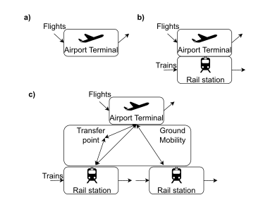

# Tactical Evaluator Pipeline

{ width=30% }

The **tacical evaluator** enables the simulation of the realisation of the (re)planned day of operations. It uses
[Mercury ABM simulator](https://github.com/UoW-ATM/Mercury/tree/multimodx) in its MultiModX branch. The MultiModX repository has this imported as an external library
(tactical evaluator).

This documentation describes the capabilites of the Tactical Evaluator and the scripts within MultiModX for the creation
of the required inputs and the computation of associated performance indicators.

See additional documentation for information on:

- [Input Files](../examples/input_format.md#tactical-pipeline-inputs)
- [Performance indicators computation](../performance_indicators/index.md#tactical-indicators)

---

## 1. Intended Audience

This documentation targets:

### Researchers

- Study robustness in passenger-centric metrics of (re)planned networks under different levels of stress (delays)
- Analyse the effectiveness of mechanisms to support multimodal connectivity

### Scenario Analysts

- Evaluate changes in infrastructure or operations that support multimodal connectivity
- Assess the number of expected missed connections under different environments

### Developers

- Prepare input datasets for Tactical Evaluator

---
## 2. Capabilities

Mercury can simulate **passengers with their itineraries** (including their connections) for flights (and **flight-to-flight** 
connection  ✈️ ↔️ ✈️) and **multimodal itineraries** (✈️ ↔️ 🚆) when passengers are connecting with a rail service 
(rail-to-flight, flight-to-rail). 

The model also simulates the required **flight**, **rail services** and **ground mobility** (🚇, 🚌) (from rail station to airport and 
from airport to rail station).

[Figure A](#fig-multimodal-connections-types) shows the different type of multimodal connections considered.

<figure id="fig-multimodal-connections-types" style="text-align: center;">
  
  <figcaption>
    <strong>Figure A.</strong> Strategic pipeline flow and outputs.
  </figcaption>
</figure>

The Evaluator can simulate any network, but focus on a given hub with its multimodal connectivity is a particularly well-suited
use case.

---

## 3. Limitations

The tactical evaluation of rail-rail connectivity is not explicitly modelled. Passenger itineraries with only rail itineraries
are not simulated. Only rail services involved in multimodal journeys are modelled.

These limitations do not hinder the evaluation of multimodal connections, and the delay for rail passengers can be estimated
as post-processing.

However, due to these modelling aspects, the [Strategic Evaluator Pipeline](../strategic/index.md#outputs-generated-by-pipeline-stage)
divides, in its final computation stage, the passenger itineraries between `pax_assigned_tactical_#.csv`  and 
`pax_assigned_tactical_not_supported_#.csv`.

---

## 4. MultiModX Scripts

As mentioned, the final stage of the **Strategic Evaluator Pipeline** is the [**generation of tactical inputs**](../strategic/index.md#6-generate-tactical-inputs-stage). 
In this stage, the output of the strategic analysis is transformed into:

- `flight_schedules_tactical.csv`, which reformat the flight schedules into the format used by the Tactical Evaluator.
- `pax_assigned_tacitcal.csv`, creating passenger itineraries to be used by the Tactical Evaluator.
- `pax_assigned_tactical_not_supported.csv`, with the information on the passenger itineraries that are not supported by the Tactical Evaluator (rail-to-rail connections and rail only itineraries).

In the GitHub repository, [script/pre-tactical/](https://github.com/UoW-ATM/MultiModX/tree/main/script/tactical), contains
**two additional scripts** are used to finalise the creation of the input for the Tactical Evaluator: 
`generate_input_for_mercury.py` (to finalise creating all required inputs) and `routes_ddr.py` (to ensure all flights have available fligth plans).

Note that the Mercury requires, in addition to the flight and rail schedules and passenger itineraries, other paramters and
distributions, such as: flight plans, ATFM regulations, minimum turnaround times, etc. All these factors and parameters are
beyond the outcome of MultiModX.

Finally, the outcome of the Tactical Evaluator is processed to generate multimodal passenger-centric indicators as
described in [**performance indicators computation**](../performance_indicators/index.md#tactical-indicators).